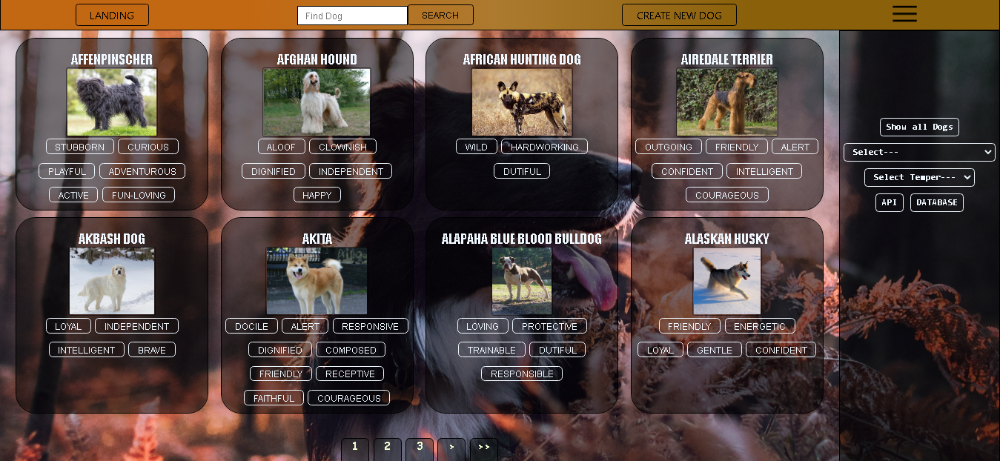
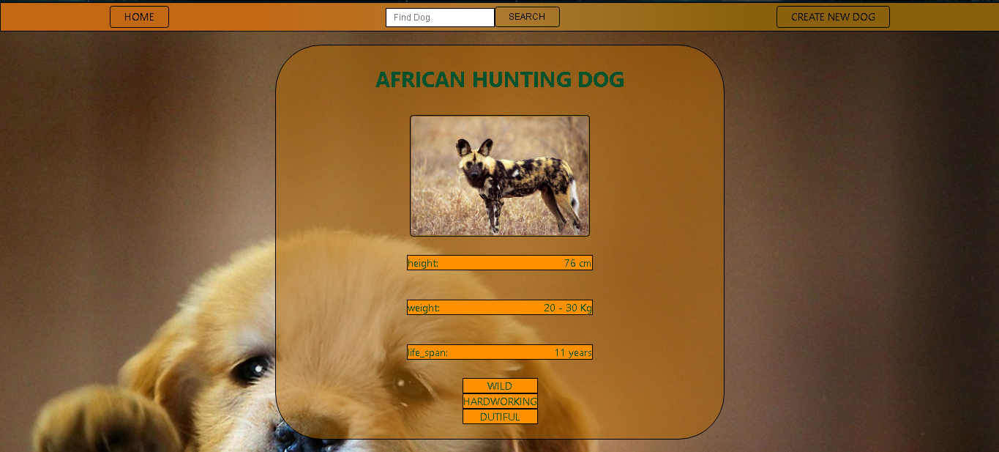
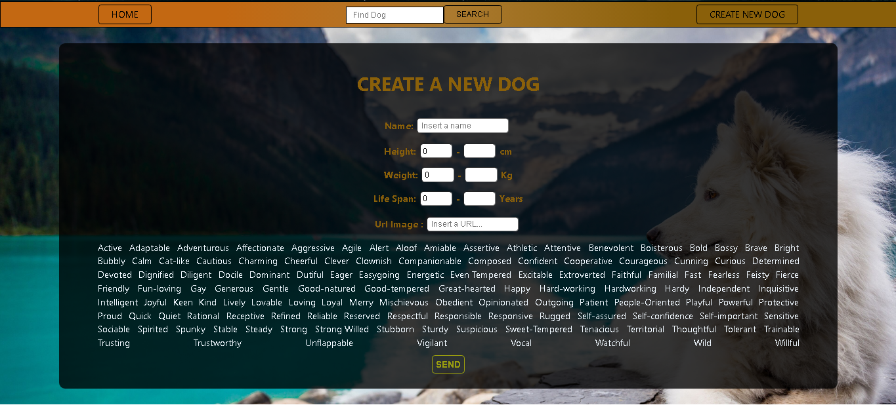
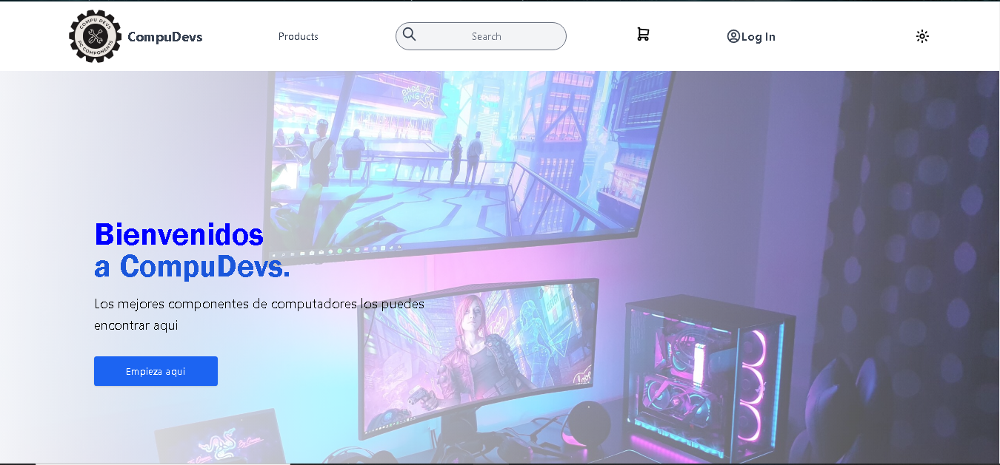
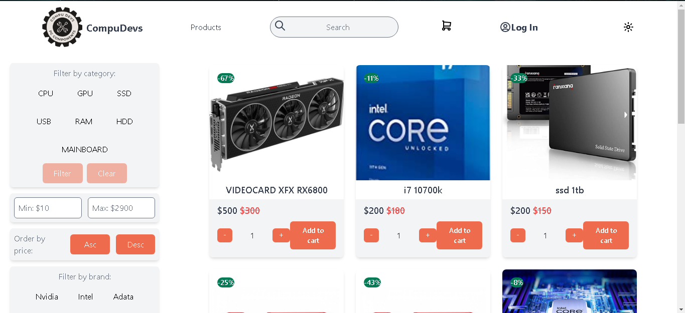
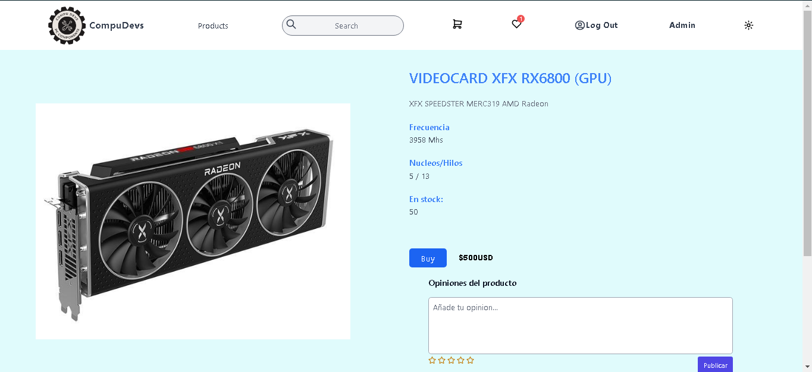
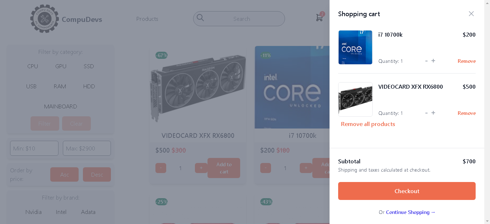
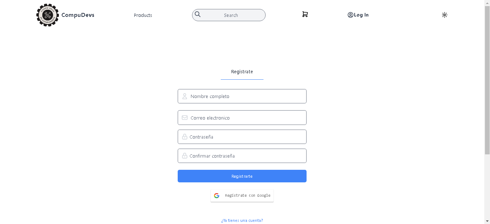
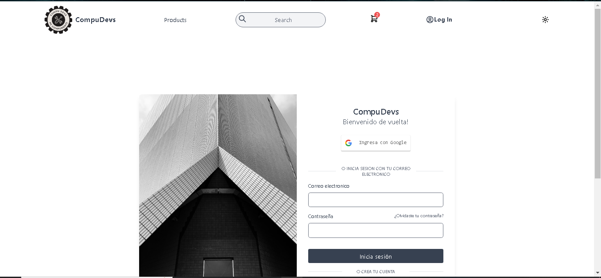

<h1 align="center"> Hi, My name is Sebastian! 👋 :computer: </h1>

```js
const Sebastian = {
  Skills: {
      BackEnd: ['NodeJs', 'Express', 'Sequelize', 'MongoDB', 'Git', 'Heroku','Postman']
        ,
      FrontEnd: [
          {JavaScript: ['React', 'React-scripts', 'Redux', 'Vercel']}
        ]
    },
  Proyects: [
      {DogsApp: ['React', 'Redux', 'NodeJs', 'Express', 'Sequelize']},
      {CompuDevs: ['React','tailwind css' ,'Redux', 'NodeJs', 'Express', 'MondoDB',]}
    ],
}
```
<div>
  <p>
    Soy una persona a la que le gustan los desafios, me gustan mucho los algoritmos, soy joven y tengo mucha energia.
    Estoy cursando Ingenieria Industrial y haciendo algunos proyectos.  
  </p>
  <strong> Espero que esta breve introduccion demuestre un poco de lo que soy capaz: </strong>
</div>
<hr/>
<h1>Para contactarme: </h1>

<p style="background: white;padding: 10px;">
    <a href="https://www.linkedin.com/in/sebastian-huerfano-a4a917244/"  target="_blank" rel="noopener noreferrer">
      
    </a>
    <a href="https://github.com/Thereapson"  target="_blank" rel="noopener noreferrer">
      
    </a>
<p/>

<h1> DogsApp </h1>

<h3>En este proyecto trabaje por primera vez sintetizando mis conocimientos de Front-End y Back-End.</h3>
Deployada en Vercel da click ----><a href="https://dogsapp-gules.vercel.app/" target="_blank" rel="noopener noreferrer">Aqui para verla</a> <---
<h4> Desarrollada con: </h4>

<ul>
  <h4>|--| FrontEnd |--|</h4>
    <li>React</li>
    <li>Redux</li>
  <h4>|--| BackEnd |--|</h4>
    <li>NodeJs</li>
    <li>Express</li>
    <li>Sequelize</li>
</ul>





<hr/>

<h1> CompuDevs- (In Progress For Perfections) </h1>

<h3>En este proyecto trabaje fortaleciendo todos los conocimientos previos y sumando nuevas bases de datos y mejorando mis habilidades sociales con el trabajo en equipo formado por: <a href="https://github.com/AndresFM18" target="_blank" rel="noopener noreferrer">Andrés Mendoza</a>, <a href="https://github.com/Angiep89" target="_blank" rel="noopener noreferrer">Angie Perdomo</a>, <a href="https://github.com/Frxncoyx" target="_blank" rel="noopener noreferrer">Franco Coronel</a>,<a href="https://github.com/Makami-Yv" target="_blank" rel="noopener noreferrer">Erik Ramírez</a>,<a href="https://github.com/Rodrigo2297" target="_blank" rel="noopener noreferrer">Rodrigo Madona</a>,<a href="https://github.com/williamagz" target="_blank" rel="noopener noreferrer">William García</a>.
Nuestro objetivo principal en este proyecto fue afianzar nuestros nuestros conocimientos tanto en el back-end como en el front-end, enfocándonos en la idea de crear un E-commerce basado en tecnología, más específicamente componentes de computadoras, aportando una experiencia de usuario óptima y a su vez bastante intuitiva.
</h3>

Deployada en Vercel, pero actualmente en proceso de perfeccionamiento(por bugs en deploy) da click ----><a href="https://compudevs.vercel.app/" target="_blank" rel="noopener noreferrer">Aqui para verla</a> <---
<h4> Desarrollada con: </h4>

<ul>
  <h4>|--| FrontEnd |--|</h4>
    <li>React</li>
    <li>Redux</li>
    <li>Tailwind css</li>
    <li>Stripe(Para los pagos)</li>250
  <h4>|--| BackEnd |--|</h4>
    <li>NodeJs</li>
    <li>Nodemailer</li>
    <li>Express</li>
    <li>MongoDb</li>
    <li>Stripe(Para los pagos)</li>
</ul>










<hr/>

<h3 align="left">Languages and Tools:</h3>
<p align="left"> <a href="https://www.w3schools.com/css/" target="_blank" rel="noreferrer">  </a>
<a href="https://expressjs.com" target="_blank" rel="noreferrer">  </a>
<a href="https://git-scm.com/" target="_blank" rel="noreferrer">  </a> 
<a href="https://heroku.com" target="_blank" rel="noreferrer">  </a> 
<a href="https://www.w3.org/html/" target="_blank" rel="noreferrer">  </a> 
<a href="https://developer.mozilla.org/en-US/docs/Web/JavaScript" target="_blank" rel="noreferrer">  </a> 
<a href="https://jestjs.io" target="_blank" rel="noreferrer">  </a> 
<a href="https://www.mongodb.com/" target="_blank" rel="noreferrer">  </a> 
<a href="https://www.mysql.com/" target="_blank" rel="noreferrer">  </a> 
<a href="https://nodejs.org" target="_blank" rel="noreferrer">  </a> 
<a href="https://www.postgresql.org" target="_blank" rel="noreferrer">  </a> 
<a href="https://postman.com" target="_blank" rel="noreferrer">  </a> 
<a href="https://reactjs.org/" target="_blank" rel="noreferrer">  </a> 
<a href="https://redux.js.org" target="_blank" rel="noreferrer">  </a> 
<a href="https://www.typescriptlang.org/" target="_blank" rel="noreferrer">  </a> 
<a href="https://webpack.js.org" target="_blank" rel="noreferrer">  </a> 
</p>
<hr/>